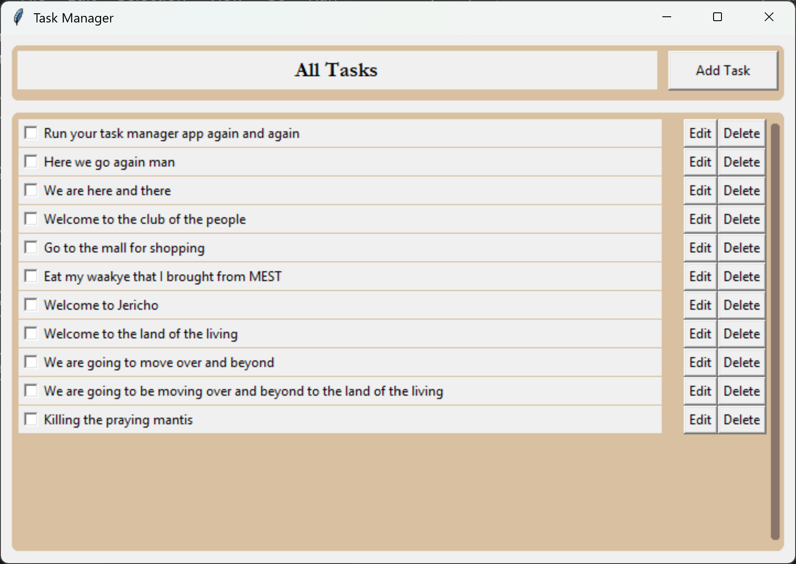
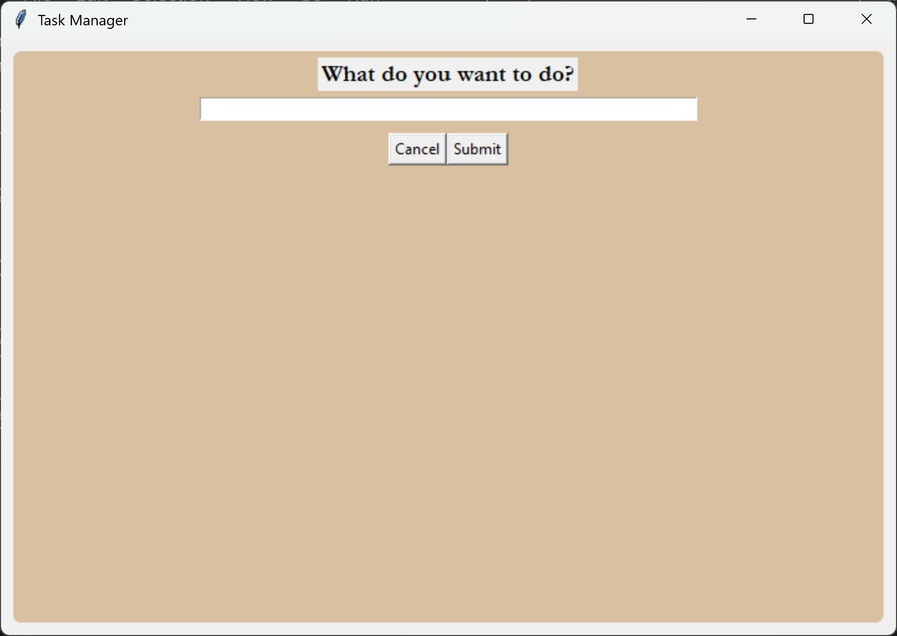
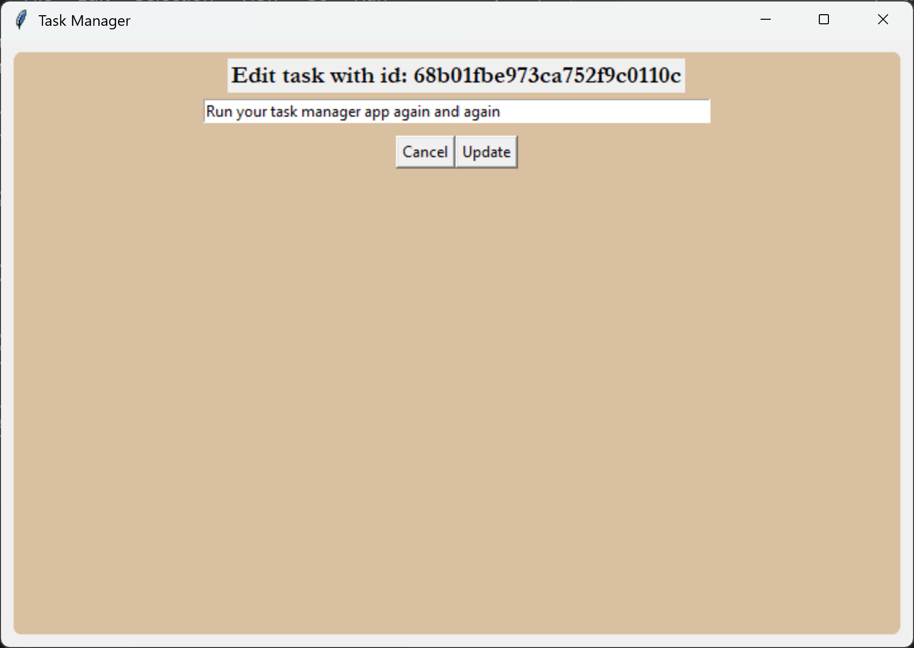
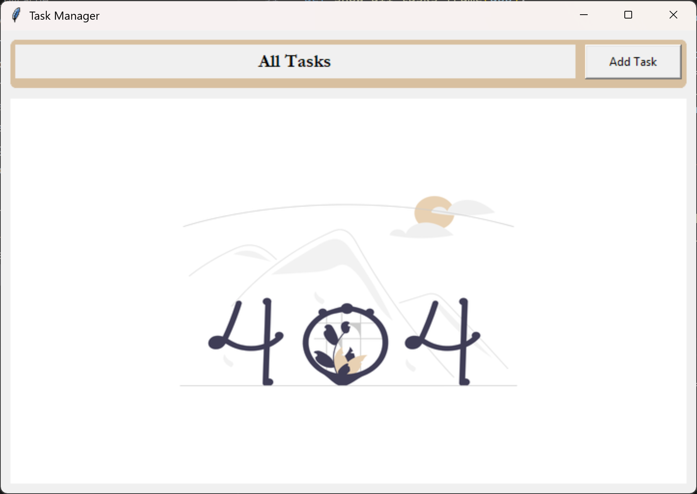

# Task Manager

A simple task manager GUI application built with Python, tkinter, and MongoDB.

## Prerequisites

- Python 3
- MongoDB

## Setup

1. **Clone the repository:**

   ```bash
   git clone <repository-url>
   cd <repository-directory>
   ```

2. **Create and activate a virtual environment:**

   ```bash
   python3 -m venv venv
   source venv/bin/activate
   ```

3. **Install MongoDB (for Ubuntu 24.04):**

   ```bash
   sudo apt-get update
   sudo apt-get install -y gnupg curl
   curl -fsSL https://pgp.mongodb.com/server-6.0.asc | sudo gpg -o /usr/share/keyrings/mongodb-server-6.0.gpg --dearmor
   echo "deb [ arch=amd64,arm64 signed-by=/usr/share/keyrings/mongodb-server-6.0.gpg ] https://repo.mongodb.org/apt/ubuntu jammy/mongodb-org/6.0 multiverse" | sudo tee /etc/apt/sources.list.d/mongodb-org-6.0.list
   sudo apt-get update
   sudo apt-get install -y mongodb-org
   ```

   For other operating systems, please follow the official MongoDB installation instructions.

4. **Start the MongoDB service:**

   ```bash
   sudo systemctl start mongod
   ```

5. **Install Python dependencies:**

   ```bash
   pip install -r requirements.txt
   ```

6. **Create a `.env` file:**

   Copy the `.env.example` file to `.env`:

   ```bash
   cp .env.example .env
   ```

   The `.env` file should contain the following line:

   ```
   MONGO_URI=mongodb://localhost:27017/
   ```

## Running the Application

To run the application, execute the `main.py` script:

```bash
python3 main.py
```

If you are running in a headless environment, you can use `xvfb-run`:

```bash
xvfb-run python3 main.py
```

## Screenshots

### All tasks screen



### Add task screen



### Edit task screen



### No tasks screen


